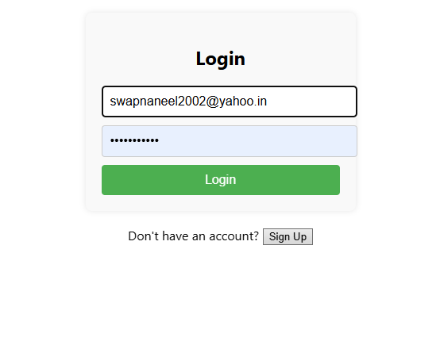
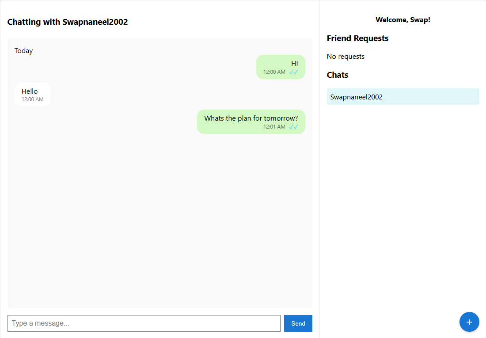

# \# ⚡ Real-Time Chat App

# 

# A full-stack real-time chat application built with \*\*React, Socket.IO, Express.js, and MongoDB\*\*.  

# 

# \## ✨ Features

# 

# ✅ Real-time private messaging  

# ✅ Message delivery and read receipts  

# ✅ Friend request system  

# ✅ Typing indicators  

# ✅ Responsive modern UI  

# ✅ Grouped messages by date  

# ✅ User login and signup  

# 

# ---

# 

# \## 🚀 Tech Stack

# 

# \### Frontend

# \- React  

# \- Axios  

# \- Socket.IO Client  

# 

# \### Backend

# \- Node.js / Express  

# \- Socket.IO  

# \- MongoDB with Mongoose  

# 

# ---

# 

# \## 🧠 Details

# 

# \- \*\*Real-time Communication\*\*: Powered by WebSockets via Socket.IO  

# \- \*\*Friend Requests\*\*: With live updates and automatic chat start after acceptance  

# \- \*\*Typing Indicators\*\*: Shows when a user is typing in real-time  

# \- \*\*Grouped Messages\*\*: Chat messages are grouped by "Today", "Yesterday", or full date  

# \- \*\*Modern UI\*\*: WhatsApp-style, mobile-responsive design  

# \- \*\*Signup/Login\*\*: Secure authentication with JWT  

# 

# ---

# 

# \## 📸 Screenshots

# 

# \### Login Screen

# 

# 

# \### Chat Screen

# 

# 

# ---

# 

# \## ⚙️ Installation \& Running Locally

# 

# 1\. \*\*Clone the repository\*\*

# &nbsp;  ```bash

# &nbsp;  git clone https://github.com/Swapnaneel2002/Chat-app-React-Socket.IO-main.git

# &nbsp;  cd Chat-app-React-Socket.IO-main


